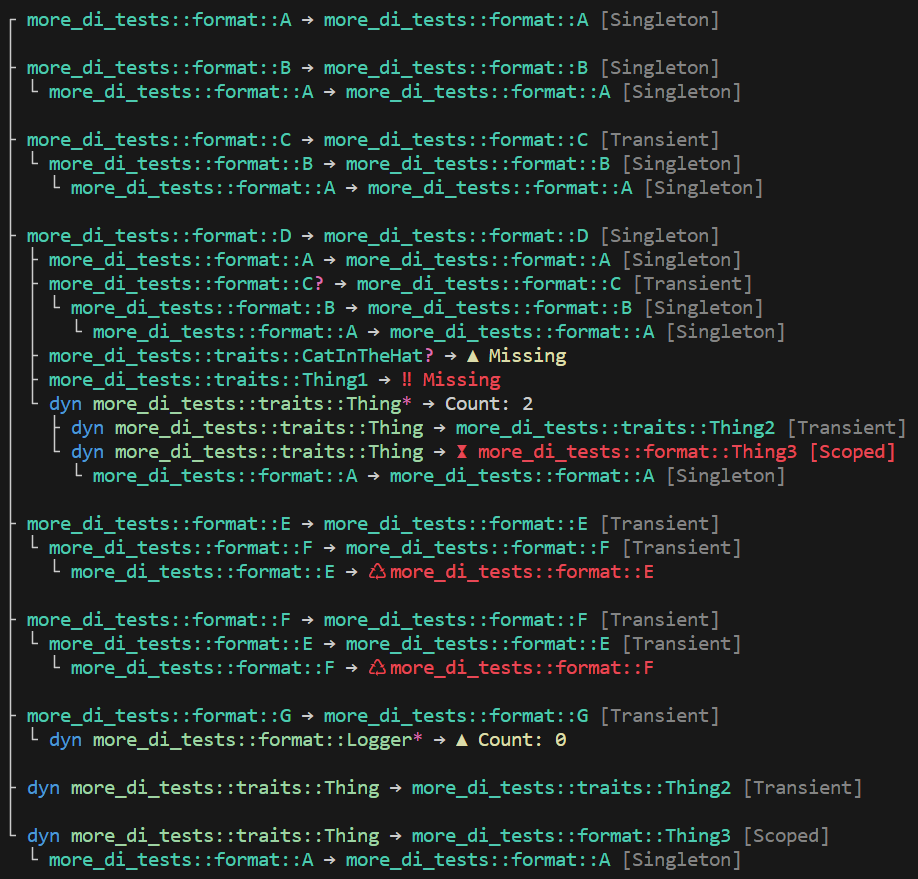

# Troubleshooting

Despite numerous forms of automatic code generation and validation, it's still possible to encounter misconfiguration where it's not clear what has gone wrong. While a validation error will tell you _what_ is wrong, it doesn't do a lot to tell you _where_ it is wrong. In these scenarios, a picture is worth a thousand words.

In order to make it easy to understand which services have been configured and for which types, `ServiceCollection` implements the `std::fmt::Debug` trait and, when the **fmt** feature is enabled, it also implements the `std::fmt::Display` trait with terminal colorization. You might take advantage of this capability for debug output, logging, or one-off inspection.

```rust
use di::*;

#[injectable]
struct Bar;

impl Bar {
    fn do_work(&self) {
       println!("Hello world!"); 
    }
}

trait Foo {
    fn do_work(&self);
}

#[injectable(Foo)]
struct FooImpl {
    bar: ServiceRef<Bar>,
}

impl Foo for FooImpl {
    fn do_work(&self) {
        self.bar.do_work()s
    }
}

fn main() {
    let mut services = ServiceCollection::new();

    services.add(Bar::transient())
            .add(FooImpl::transient());

    // we can print the service collection at any time, including here:
    // println!("{}\n", services);

    match services.build_provider() {
        Ok(provider) => {
            let foo = provider.get_required::<dyn Foo>();
            foo.do_work();
        },
        Err(validation_errors) => {
            // display the validation errors and entire service collection
            println!("{}\n{}", validation_errors, services);
        }
    }
}
```

A distinct difference between validation and display is that validation will only show errors, whereas display can show warnings and relationships.

## Display Output

### Symbols

- `?`  = zero or one
- `*`  = zero or more
- `⚿` = service key
- `▲`  = warning
- `‼`  = error
- `♺` = circular reference
- `⧗`  = lifetime

### Warnings

- An optional service is missing
- A list has no registered services

### Errors

>These are the same errors detected and raised by validation

- A required service is missing
- A service has a circular reference
- A service with the lifetime `ServiceLifetime::Singleton` depends on a service with the lifetime `ServiceLifetime::Scoped`

## Example Output

The following example demonstrates outputting an entire service hierarchy, including warnings and errors.

